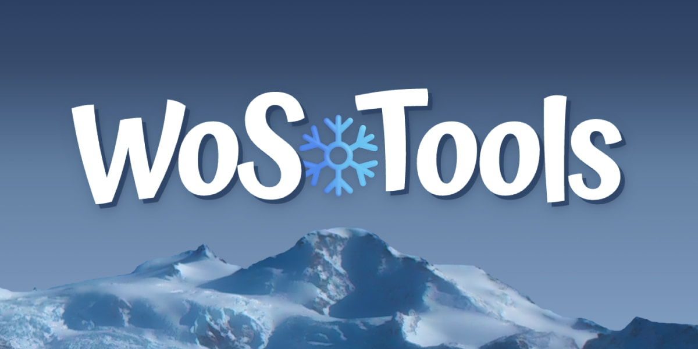

# WoSTools

[](https://app.netlify.com/sites/wostools/deploys)

[](https://github.com/antfu/eslint-config)

A website with a collection of tools for the game Whiteout Survival.  
Built with Nuxt 3 (Vue 3/TypeScript), PrimeVue, and Tailwind CSS.



## Setup

If using [mise](https://mise.jdx.dev/), simply run `mise dev`. Otherwise:

Install the Node and pnpm versions listed in [`.tool-versions`](.tool-versions).

### Install commit hooks:

```sh
npx simple-git-hooks
```

### Install dependencies:

```sh
pnpm install
```

## Development Server

Start the development server on [`http://localhost:3000`](http://localhost:3000):

```sh
pnpm dev
```

## Production

Build the application for production:

```sh
pnpm build
```

Locally preview production build:

```sh
pnpm preview
```
